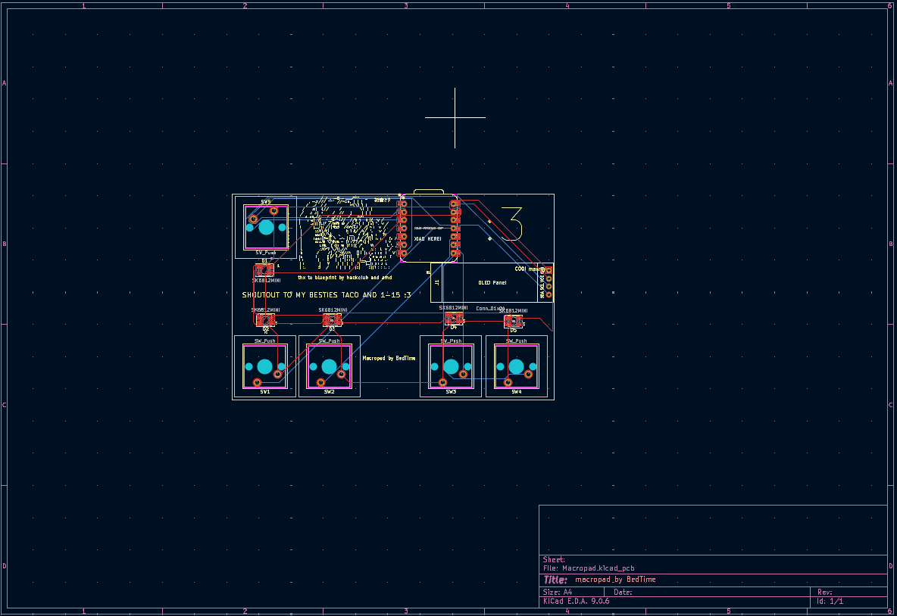
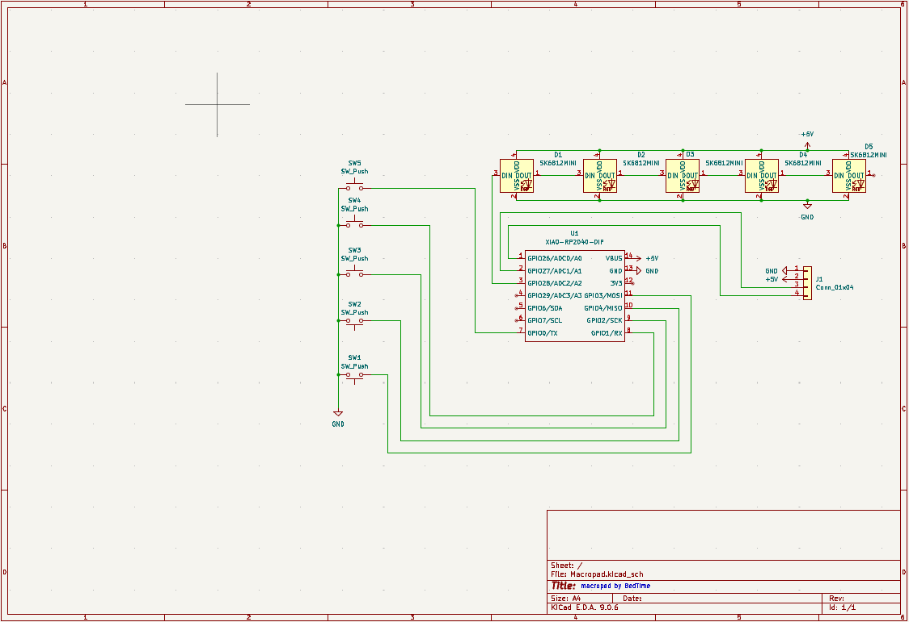
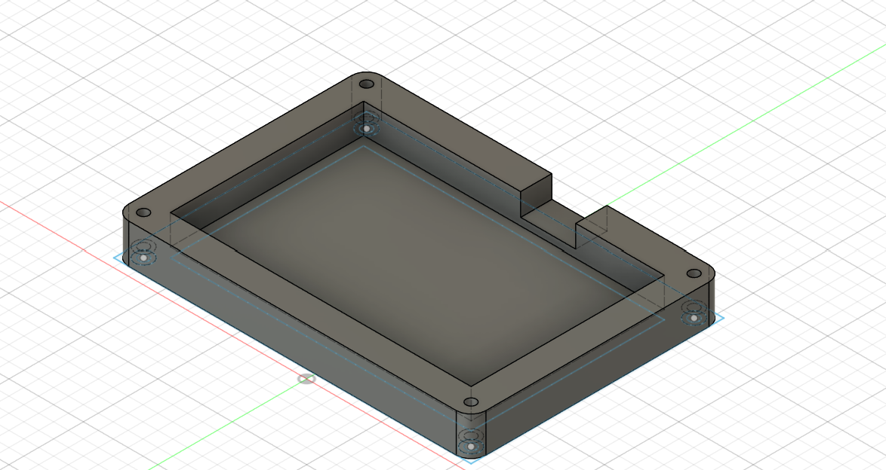
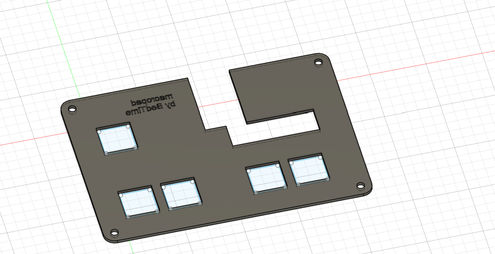

# Macropad by BedTime thanks to blueprint by Hackclub and AMD !!!!

On 6 of december,
I started designing the macropad, with the intent of 
making a 4 keys keyboard for ddr like games.
after some thought I decided to add a enter and dfjk keys.

# features 

1. DFJK input macropad.

2. Oled showing keys being pressed.

3. 5 leds sk6812mini

4. 5 cherry mx switches 

5. XIAO RP2040 based

![PCB 3d render [1]](Assets/PCB_model_1.png)
![PCB 3d render [2]](Assets/PCB_model_2.png)

# BOM:

- Bill of Materials 

Item	                    	                           

- Cherry MX Switches	Standard mechanical switches	5	

- Blank DSA Keycaps	Profile keycaps compatible with MX switches	5	

- SK6812 Mini LEDs	Addressable RGB LEDs	5	

- Seeed XIAO RP2040	Microcontroller board (RP2040)	1	

- M3×16 Bolts		4	

- M3 Heatset Inserts	Brass inserts for mounting	4	

- PCB Fabrication	from jlcpcb	1	

- 3D Printed Case – Top	Custom enclosure piece	1	

- 3D Printed Case – Bottom	Custom enclosure piece	1	

# CHALLENGES 
I am absolutly new to circuit design and 3d modeling 
and even though the process was really straight 
forward thanks to the tutorial, using fusion 360 
gave me some headaches for sure.

# Changes for the future

- I would like to setup the current "enter" key to be a 
"change" or "mode" key to change betweent layouts 
(getting dfjk to be arrows for example).

- Getting the Display to show more stuff.
the original idea was to have the display to show the
keys being pressed for aesthethics but also i've been 
thinking about makingit capable of showing information 
from api's.
(like media playing, weather, gif's, etc.)

- I will be updating the repo if any problems are found with either the design or the code used, also images from the product ensambled :3.

THANKS a lot to hackclub and amd for creating 
blueprint check it out at https://blueprint.hackclub.com/. ^^
